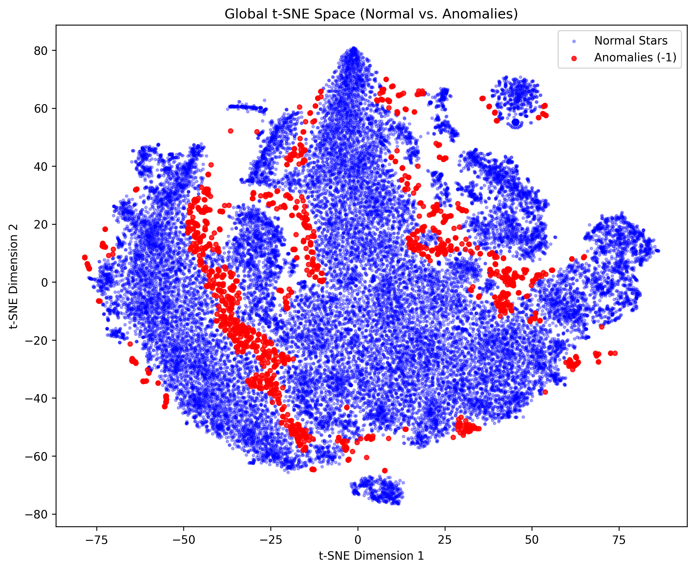
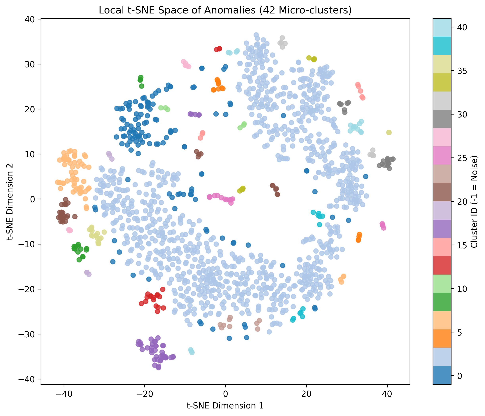

# GALAH DR4 Stellar Anomaly Detection

Reproducing and extending the methodology from [Traven et al. (2016)](references/galah_paper.pdf) using the latest **GALAH Data Release 4** — applying t-SNE dimensionality reduction and DBSCAN clustering to ~tens of thousands of stellar spectra to surface anomalous stars and cross-match them against SIMBAD.

---

## What This Project Does

The [GALAH survey](https://galah-survey.org/) (GALactic Archaeology with Hermes) is a large-scale spectroscopic survey of stars in the Milky Way. With DR4 now publicly available, this project:

1. Downloads and organises raw FITS spectra from the GALAH DR4 dataset
2. Preprocesses each spectrum — de-redshifting, regridding onto a uniform wavelength grid, and continuum-normalising
3. Reduces dimensionality with PCA (50 components) to compress 4096-pixel spectra
4. Runs a **global t-SNE + DBSCAN** pass to isolate the bulk of "normal" stars
5. Runs a **local t-SNE + DBSCAN** pass on the remaining anomaly candidates to find distinct spectral groups
6. Cross-matches cluster representatives against the **SIMBAD** astronomical database to identify what these weird stars actually are

The approach mirrors the two-pass t-SNE strategy in Traven et al. (2016), adapted for DR4's updated catalog and file structure.

---

## Results

### Global t-SNE — Normal Stars vs. Anomalies

The blue cloud is the bulk of well-behaved FGK stars. Red points are DBSCAN outliers that don't fit neatly into the main stellar locus — these are the candidates worth investigating.



### Local t-SNE — Anomaly Micro-clusters

Re-embedding just the anomaly candidates reveals 42 distinct spectral groups. Each colour is a separate cluster; the pale blue background points are noise that didn't cluster tightly enough to be labelled.



### SIMBAD Cross-Match Highlights

The 42 clusters were cross-matched by sky coordinate against SIMBAD. Selected findings from [`results/simbad_results.txt`](results/simbad_results.txt):

| Cluster | Stars | SIMBAD Match | Type |
|---------|-------|--------------|------|
| 2 | 591 | Cl* NGC 104 LEE 3627 | Star in globular cluster (47 Tuc) |
| 3 | 370 | 2MASS J05422395-2038024 | **Eclipsing Binary (EB\*)** |
| 12 | 16 | UCAC4 158-009927 | **Peculiar Star (Pe\*)** |
| 18 | 3 | UCAC4 250-006602 | **Red Giant (RG\*)** |
| 24 | 3 | NGC 5139 1627 | Star in ω Centauri |
| 36 | 16 | Cl* NGC 5139 LEID 31025 | Star in ω Centauri |
| 39 | 11 | Cl* NGC 5139 LEID 47456 | **Peculiar Star in ω Cen (Pe\*)** |
| 40 | 4 | NGC 5139 5524 | **Eclipsing Binary in ω Cen (EB\*)** |

Notable: multiple clusters trace back to **NGC 104 (47 Tucanae)** and **NGC 5139 (ω Centauri)** — two of the most massive globular clusters in the Milky Way. Their chemical peculiarity (e.g. the Na–O anticorrelation in globular cluster stars) naturally makes them spectral outliers relative to the field star population.

---

## Pipeline Overview

```
GALAH DR4 Catalog (.fits)
        │
        ▼
generate_datapoint.py        ← Extract sobject_ids into CSV batches
        │
        ▼
Data Central download        ← Fetch .tar archives of FITS spectra
        │
        ▼
01_extract_tars.ps1          ← Extract archives
02_flatten_structure.ps1     ← Flatten into com/ directory
        │
        ▼
step1_preprocess_spectra.py  ← De-redshift, interpolate, normalise
step2_normalize_pca.py       ← Continuum norm + PCA (50 components)
step3_global_tsne.py         ← t-SNE + DBSCAN: filter normal stars
step4_anomaly_simbad.py      ← Local t-SNE + DBSCAN + SIMBAD query
```

For large-scale runs (tens of thousands of stars), the consolidated `kaggle_pipeline/DSA_Kaggle_3.py` runs the entire pipeline end-to-end using GPU-accelerated openTSNE on Kaggle.

---

## Reproducing This

### Requirements

```bash
pip install -r requirements.txt
```

Dependencies: `numpy`, `scipy`, `astropy`, `astroquery`, `scikit-learn`, `openTSNE`, `matplotlib`, `tqdm`

### Data

The raw data is not included in this repository (FITS files are too large). To reproduce:

1. Download `galah_dr4_allspec_240705.fits` from [GALAH Data Central](https://datacentral.org.au/)
2. Run `data_acquisition/generate_datapoint.py` to produce ID batches
3. Use the generated CSVs to request FITS spectra via Data Central's bulk download, saving `.tar` archives locally
4. Run `01_extract_tars.ps1` then `02_flatten_structure.ps1` to organise into `galah/dr4/spectra/hermes/com/`

### Local Run (CPU)

```bash
python local_pipeline/step1_preprocess_spectra.py
python local_pipeline/step2_normalize_pca.py
python local_pipeline/step3_global_tsne.py
python local_pipeline/step4_anomaly_simbad.py
```

### Kaggle Run (GPU, Recommended for Large Batches)

Upload your flattened spectra as a Kaggle dataset and run `kaggle_pipeline/DSA_Kaggle_3.py` as a notebook. Update `SPECTRA_DIR` and `CATALOG_PATH` at the top of the script to match your dataset paths.

Key tuning parameters in the Kaggle script:

| Parameter | Default | Effect |
|-----------|---------|--------|
| `CCD_ARM` | 3 (Red) | Which HERMES arm to use |
| `N_PCA_COMPONENTS` | 50 | Dimensionality before t-SNE |
| `GLOBAL_EPS` | 3.0 | DBSCAN epsilon for normal star isolation — increase to catch fewer anomalies |
| `TSNE_PERPLEXITY` | 30 | t-SNE perplexity |

---

## Key Design Decisions

**Why the red arm (CCD 3)?**  
The red arm covers ~6500–6700 Å, including the Hα line — the most diagnostic feature for stellar activity, emission, and binary signatures.

**Why PCA before t-SNE?**  
t-SNE is O(N²) in dimensionality for the pairwise distance computation. Compressing 4096-pixel spectra to 50 PCA components (retaining ~95%+ of variance) makes the computation tractable without losing the physics.

**Why two-pass t-SNE?**  
The global pass has to deal with tens of thousands of "boring" FGK dwarfs and giants. Their sheer number dominates the embedding and squishes the rare peculiar objects together. Filtering them out first and re-embedding only the anomalies gives the local structure of the weird stars room to breathe — this is the core insight from Traven et al. (2016).

---

## References

- Traven, G. et al. (2016). *The GALAH Survey: Classification and Diagnostics with t-SNE Reduction of Spectral Information.* [arXiv:1612.02242](https://arxiv.org/abs/1612.02242)
- van der Maaten, L. & Hinton, G. (2008). *Visualizing Data using t-SNE.* Journal of Machine Learning Research, 9, 2579–2605.
- Buder, S. et al. (2024). *The GALAH Survey: Data Release 4.* [galah-survey.org](https://galah-survey.org/)

---

## Notes & Limitations

- Results depend on DBSCAN hyperparameters (`eps`, `min_samples`). The current defaults work well for ~10k–30k star batches but may need tuning at different scales.
- SIMBAD cross-matching uses a 10 arcsec radius on the cluster's representative star — nearby field objects can occasionally be the returned match rather than the GALAH target itself.
- t-SNE is non-deterministic; re-runs will produce topologically similar but not pixel-identical maps. The anomaly membership is stable; the exact 2D layout varies.
- This covers ARM 3 only. Running all four HERMES arms and combining the results (as in the original paper) would surface additional categories like cool stars with molecular bands (ARM 1) and IR-excess objects (ARM 4).
